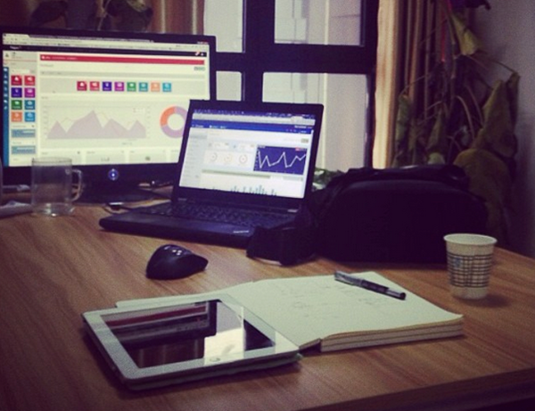

不久之前发现了一个有趣的网站，或者说是很久之前注册过但前两周才正式捡起来完善了个人资料的网站，缘创派。 完善后第二天就有人主动联系。

首先联系到我的是西安本地的一个初创团队，主做微信营销。我也亲自去到他们公司面谈，后又与创始人之一的P同学相约咖啡馆细聊一下午。 不得不佩服真正做事情的人的执行力。 从开始有想法，到集合技术大牛、拉到风投、租用场地、置办办公硬件等等半个月内完成，目前接近一年的运营他们已经有了一定规模。 从他们身上我也确实看到一些我非常值得学习的地方，但面对他们的工作邀约，我还是因为自己不想离开ID大范围而不能应下来。 However，我仍然接下来了他们的一个UI项目，是他们拳头产品的后台UI。 于我，这是一个全新的挑战与尝试，于他们这是一个项目外包的开始。 我理想的情况是，今后如果有类似项目需要，我仍然可以以一个第三方自由设计师的身份参与其中。

真正的执行者往往都是夜行动物，在前一夜12点与P同学首次电聊的次日夜间，我又遇到了另一个创业者D君。与P同学不同的是，D君已经是一个深经历练的老手；但与P同学相同的是，他们的言语间都包含着自己不磨灭的热忱和专业精神。 D君混迹深圳和西安，我从电话中感受到他对于未来的坚定信心，也从网上也了解到他丰富而又恢弘的过去。

后来也遇到了一个彻头彻尾的梦想者，他看似不脚踏实地的行为方式以及近乎亢奋的梦的热情让我望而却步，也没有再联系过。

最近一直保持联系的是一个北京的资深人士，我们话很投机，我计划近期去北京面谈一次。希望这能够是一个好的开始。

这些经历都来自缘创派，我也相信后面会有新的机会，新的有趣的DOers出现，我也很期待后续的更新。PS，我的缘创派地址是:[http://www.ycpai.com/home/person/17102](http://www.ycpai.com/home/person/17102 "http://www.ycpai.com/home/person/17102")
