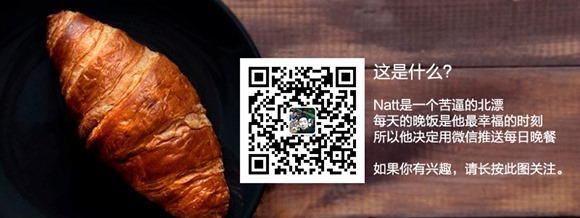

近期我趁着假期开展了一个实验性的个人小项目，事情是这样的：

 

我是一个苦逼的北漂，为了一个单纯的赚大钱的梦想在帝都苦苦支撑，日复一日的耕耘着。生活渐渐失去激情，目光渐渐只看脚下。每日加班临近下午饭点时候的一句“今天点什么外卖”成了每天最舒服最放松的时刻。于是，我决定用一个微信公众号记录自己的晚餐，以一柄放大镜的形式仅仅通过每日晚餐记录自己的生活轨迹。

 

于是就有了下面的公众号：Natt的晚饭

 

 

但，仅仅止步于此就太显单调。

 

于是，我开了3个栏目：约吃饭，加个蛋，吃啥好。约吃饭是一个表单来和我面基用的，加个蛋是看官如果觉得我生活太惨，可以从这里为我打赏，加个卤蛋汽水什么的。吃啥好是一个预留栏目，暂未完善。受限于公众号个人认证的功能限制，约吃饭和加个蛋的功能我是通过MikeCRM实现的，而吃啥好短期内没有时间精力来完善，就先这样吧。

 

这里，欢迎各路朋友扫描关注，通过关注我的晚饭来关注我。
