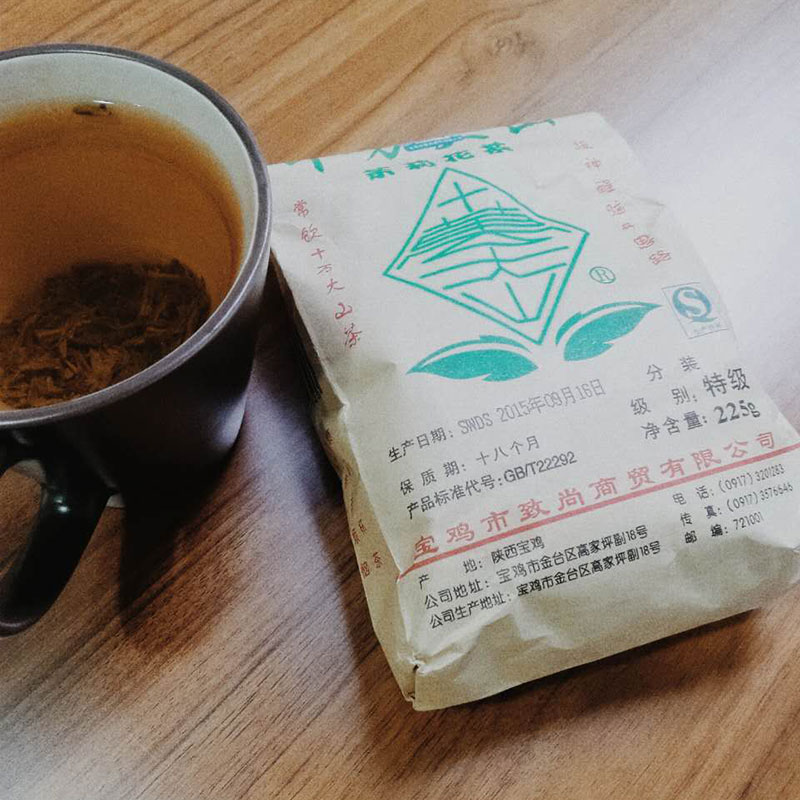

在我很小的时候，大概那时候爸爸也比现在的我大不了多少的时候，爸爸经常带我回爷爷的老院子。那个时候爸爸和爷爷总会聊很多事情，小孩子是没有多少耐心仔细倾听的，就满院子乱跑。午饭后自然就会犯困，爸爸和爷爷都会喝奶奶煮的茶，虽然当时我还对茶没什么直观的印象，但那差不多是我对茶的第一印象了。爸爸让我喝一口，苦。

  

后来一两年，大概在我学龄前后，我在妈妈的办公室里看到一个姓贾（60%可能，记不清了）的叔叔从茶叶罐子里捏出一点点干茶叶直接放进嘴里咀嚼，当时特别惊叹，“茶还能吃？”我问，叔叔说道“茶，能喝就能吃啊”。小时候的我是一个非常害羞的人，不敢当面找叔叔讨茶吃一口，而是跑回家拿出自家茶叶罐吃了一口，苦的我瞬间就吐了出来。这个叔叔也是我唯一一次看到人吃茶叶。

  

渐渐的，大约在初中高中的年纪，我开始慢慢懂得世间事，回到爷爷家院子里也会喝两口浓烈的茶，并自以为知道了“苦尽甘来”的味道。忍者咽下暗黄的茶汤，并等待那一点点回甘。

  

大学的时候也买过几次茶，一次是在屏山画画的时候，买了一罐黄山毛尖，我跟茶贩说我喜欢口味重一点的，但是怎么都冲泡不出那股浓烈。

  

出国前，我在紧张无比的箱子里带了一包茶叶。曾在拉夫堡村子里的教堂Open Day与当地人一同活动聊天，一位名叫Judith的Old Lady 指导我和A同学一同喝了所谓 British Tea, 虽然不列颠的红茶+牛奶的喝法很文艺很精致，但都对不上我喜欢的口味。

  

到北京后这种茶叶一直没断，这也是当年记忆中爸爸和爷爷爱喝的茶。一种名叫“十万大山”的茉莉花茶，它伴随我上大学，伴随我去英国，伴随我自由职业也伴随我入京创业。这种茶叶大约20元左右一包，实实在在的屌丝茶，但它其中包含了从小到大我对茶的认知，包含了我对爷爷老院子里味道的怀念，也包含了浓烈茶汤后面回甘的那一点点熟悉的期待。

  

4年前的这几天，爷爷白血病去世的，这种病查不到病因，但后来爸爸说这与爷爷多年来每天煮浓烈的茶的习惯有可能多多少少有点关联。世事无常谁又知道会怎样呢。

  

但这个茶叶似乎就是我喝的情怀。

  

周四寒衣，不孝没能送上寒衣，但也仅仅靠此文字加以追思。
