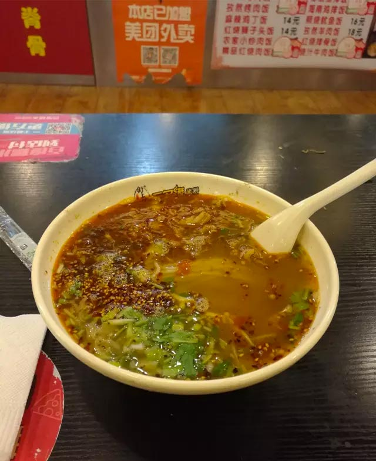

 

傍晚6点，一个步履徐徐面无表情的小伙子走进了小吃城，一天的改稿加晚上即将到来的在线课程让他疲惫不堪。小吃城里没什么顾客，倒是各种O2O外卖平台的机器喊个不停，订单从空中飞来。老板和伙计坐在角落抽烟，其他几个伙计在不怎么忙碌地照顾各个外卖平台来的订单，几乎无人堂食。

这个男人缓缓绕过排骨米饭，绕过盖浇饭，绕过一个空余的档口，到了一家新开的米粉店。老板老两口操着浓重的东北大茬子招呼着生意。小伙子随口说了句肥肠米线。眼前的汤头沸腾，老板热情地说要不要辣要不要蒜，回过神之际老板突然说道送你一个烧饼，要不然吃不饱。可他不知小伙子一天的电脑前劳作最怕的就是吃太饱。

这个免费的馈赠让小伙子想起了一件旧事。

大约初中的时候，小伙子和妈妈一起走在某五六线城市的小街头，走进一家叫做“川北砂锅”的店面，一人一碗砂锅米线，自然是麻辣的。随后来了一个年轻的妈妈带着年幼的孩子，孩子一直在说要吃小小的鹌鹑蛋。小伙子现在已经记不起当时他们点的是什么砂锅了，但可以肯定的是那个配置没有鹌鹑蛋。淳朴的老板娘为他们 加了两个进去没有要钱。那时候，一碗米线只要2块5毛钱。

 

 

勾起我回忆的，就是这一碗吃不饱的米线。
