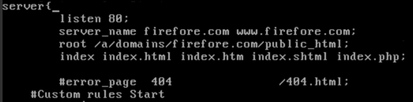

这是一个一个菜逼的百度BCC折腾手记。

公司之前的网站服务器到期了，想着把各个二级域名的小站整合在一起，就注册了一个百度BCC，1核2G1M的屌丝配置，但是差不多也够够的了。之前用过WDCP的面板，感觉还不错，包括这个小博客就是跑在WDCP面板的服务器上的，所以这次依旧没有任何犹豫在CentOS 6.5x 64 上一键WDCP搭建了Apache 和 Nginx可以互相切换的环境，想象中高枕无忧了。

跑了一个月，平均三四天左右就会出现一次数据库无法连接，重启web服务可解决。无法连接数据库没有任何征兆和预警，说来就来。用了360的网站监控，最近都神经衰弱甚至会想怎么还没有崩....

终于今天利用周末集中解决一下这个问题。

首先，解决方案是利用 百度BCC可选的主机宝CentOS6.5 x64 所带的环境。但前前后后遇到几个坎，下面一一说来。

> 问题1：数据库sql导入，先是phpmyadmin 20mb的导入限制，修改php.ini很容易提升，但不知为何sql数据上传过程中大约在30s的时候回闪回到上传0%再次开始，无解。
> 
> 解决1：利用putty执行sql语句导入上传的sql文件
> 
> 标准命令：mysql -u数据库用户名 -p数据库密码 数据库名 < 数据库文件名.sql
> 
> 示范案例：mysql -ulaozuo -plaozuo.org laozuo < laozuo.sql
> 
> 出处在此：http://www.laozuo.org/974.html

> 问题2：备份恢复之前我关闭了wp-super-cache的，但再次安装wp-super-cache之后就出现了后台报错
> 
> 解决2：修改 wp-config.php 和 wp-cache-config.php 两个文件中对于缓存位置的绝对路径。前者在网站根目录，后者在 根目录/wp-content 目录。
> 
> 出处：自己摸索的

> 问题3：主机宝的配置里，会把WordPress自带的404解决方案屏蔽掉，转而变成Nginx的404，非常不利于用户体验和SEO
> 
> 解决3：进入putty连接后用下面这个命令：
> 
> <table><tbody><tr><td class="code"><pre class="bash">cd /a/apps/nginx/vhosts/
> vi firefore.com.conf #使用时请根据实际文件名，就是网址.conf的格式</pre></td></tr></tbody></table>
> 
> 把error\_page 404 /404.html这个段注释掉（在前面加入＃即可）
> 
> 
> 
> 修改后，先按一下键盘的ESC键，退出编辑模式，然后输入:wq的命令，就可以保存退出。再重启Nginx服务即可恢复WordPress的404.
> 
> 出处：http://firefore.com/zhujibao-wordpress-404.html

写这个blog的目的有二：其一，是没准自己以后还会遇到同样问题，梳理出一个方案之后备查；其二，感谢互联网的分享精神，我可以从前辈那里获得一个个解决方案解决自己的问题，也发扬互联网分享精神，帮助未来可能遇到同样问题的人。

ps. 本人是设计师，非程序员，所有主机问题全靠互联网。
