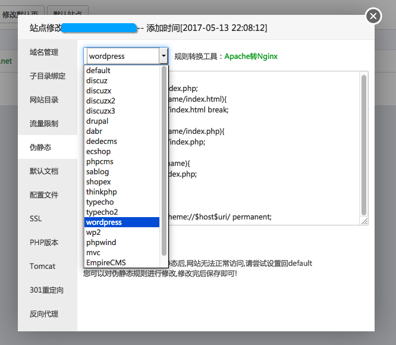
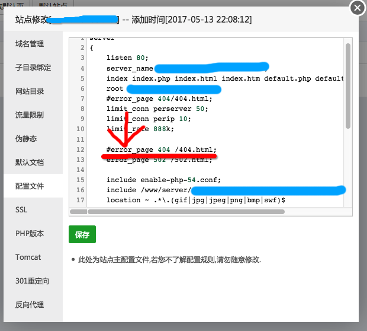
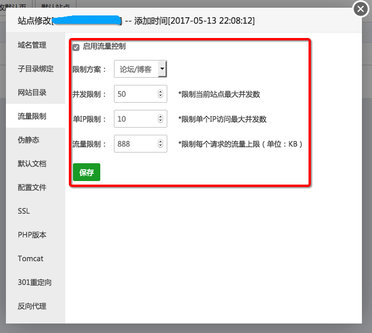
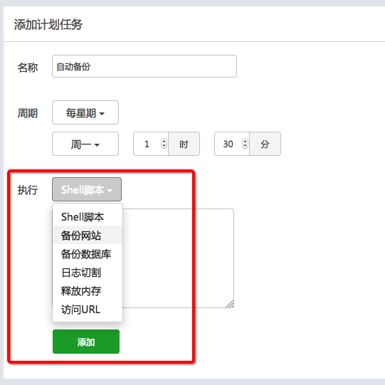

之前我的网站使用了主机宝面板，但一直被CC搞得我很头大，虽然用360CDN防了一层，但还是有漏网之鱼。

无意间又发现了一个面板，即BT（宝塔），小博客服务器试用之后决定主站也更换，主要是更加的零基础友好。确实好用。

安装，使用SSH连接主机后一件安装即可：

> yum install -y wget && wget -O install.sh http://download.bt.cn/install/install.sh && sh install.sh

1. 确认wordpress伪静态

在网站设置面板的“伪静态”里，直接选择“wordpress”即可，简单粗暴

1. 还原wordpress自带的404 由于nginx的404页面非常不友好，所以需要回复，比起其他面板的修改，宝塔的只需要在面板可视化的配置文件里改即可，具体做法是吧error\_page 404 前面用#注释掉即可 如图：

 

1. 设置流量限制解决CC

简单粗暴如图： 

具体并发数和限制根据自己服务器情况设置即可。

1. 设置自动备份

全傻瓜化自动备份，还可以选择备份存放在七牛云或者阿里云OSS，这个网站较大所以我选择放在本地服务器 

* * *

自此，完美的通过宝塔面板搭建wordpress环境并解决相应问题。

希望能帮到小白。
