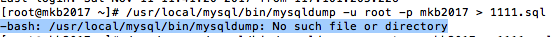

趁着11·11，买了一台京东云的服务器给网站做更新，虽然对京东云的可信度不能保证，但基本上市场价2折左右的价格还是让人心动不已。但之前的服务器被自动备份撑炸了一次之后，安装的三方面板就进不去了，于是有了今天搬家的折腾旅程。

思路：

1\. 备份网站文件和数据库

2\. 下载并上传到新服务器（提前装好环境）

3\. 配置调试

其实很简单，但是第一步由于面板死了，对我来说就有点难度了。于是我开始寻求解决方案。

 

几经查找，在这里（https://www.vpser.net/manage/mysql-import-export.html）找到了SSH备份的方法

MySQL数据库导出 方法1:mysqldump命令

> 执行命令： /usr/local/mysql/bin/mysqldump -u 用户名 -p 数据库名 > 文件名.sql 如果数据库用户名有密码密码，执行后会提示输入密码。如果数据库用户名没有密码，就将命令中的“-p”参数删除。导出的文件保存在当前目录下，也可以将 文件名.sql 换成绝对路径，如 /home/backup/文件名.sql
> 
> 另外有一个参数，不用写数据库名，将全部数据库都导出： --all-databases
> 
> 注意：推荐使用MySQL root帐号进行操作，因为有些数据库可能设置了只能对应的用户进行操作。

在操作过程中并没有找到路径，如下图：

于是在winSCP里搜索了一下，找到了新的路径 /www/server/mysql/bin/mysqldump

注意输入用户名的地方，要输入数据库的user name, 而密码那里也是数据库的 密码，之前输入的 root 和 VPS 的密码都显示错误了。

文件会被保存在“当前目录”下，如果找不到，用winSCP 搜索一下文件名就很容易找到了。然后下载保存即可

最终我的命令如下：

> /www/server/mysql/bin/mysqldump -u 66666(database username) -p 66666(database name) > 1111.sql

 

问题解决
