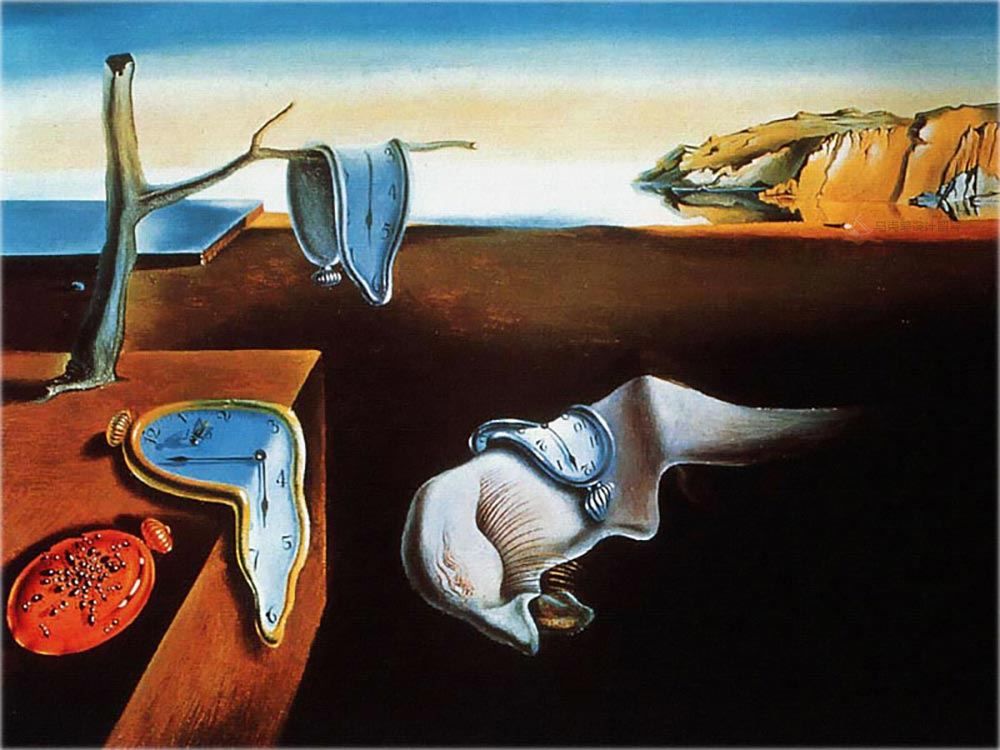
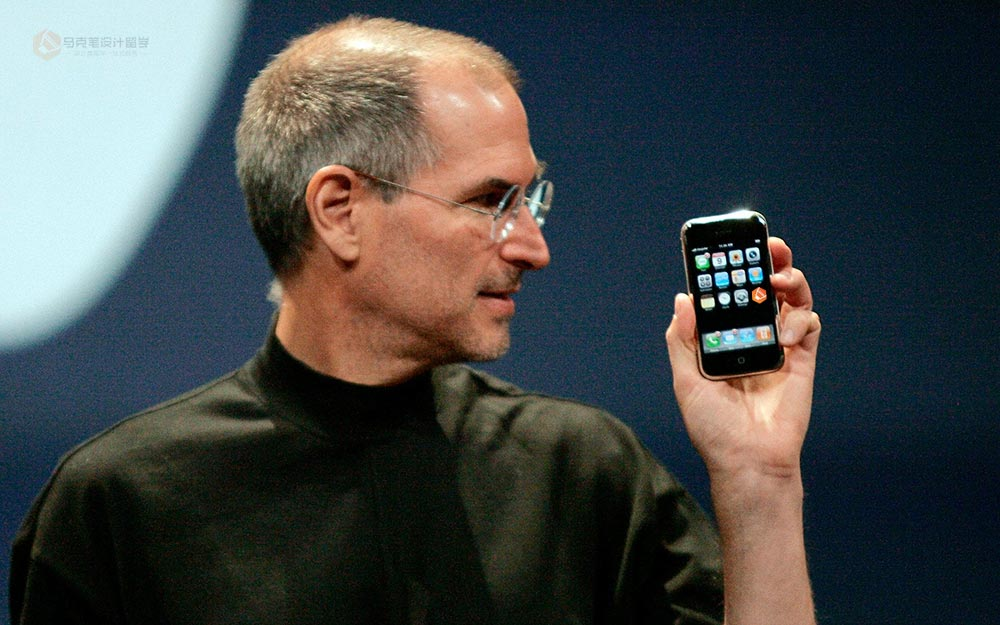

前言：对于大部分本科学生在硕士选择专业的时候，很大的一个问题就是我该选择什么样的专业作为硕士专业，一方面是自己对于行业趋势的不确定性（本文不做讨论），另一方面困惑来自自己对各个专业的未来不清晰（中国教育的锅），所以，本文站在一个从事设计留学多年的教育者的角度，来聊一聊有关未来的选择问题。

中国的设计教育与国外设计教育存在一定的差异（或差距），其中一项即中国的设计教育行动较慢，自从乔布斯2007年发布iPhone到现在已经接近11年了，这一个十年中交互设计井喷式发展，甚至出现2012-2016年的移动互联网大浪潮。而在这样的大背景下，社会对交互设计人才奇缺，但时至今日，中国本科正式开设交互设计专业的学校少之又少。大部分交互设计人才都来自工业设计、心理学等专业。另外随着“硬件”本身的限制以及来自“服务”和“用户体验”角度的设计空间越来越大，服务设计在这两年的申请中也逐渐被更多人所重视。

所以在在这里，我将会分享我对于这几个专业概念的认识。风格上我将尽可能精炼、短、大白话，以方便学生或家长的阅读。少用术语，多谈体会。

 

### 1.工业设计

Industrial design is a process of design applied to products that are to be manufactured through techniques ofmass production. -wikipedia

以wikipedia的解释，工业设计是设计那些能够被大规模生产的产品的过程。放在若干年前我背着书包漫步在大学校园的时代，这个解释非常准确。而放在现在，似乎它的范畴里少了些内容。

这几年工业设计的发展，已经非常强烈地吸收了来自交互设计、服务设计、用户体验和系统设计等领域的思维方式与设计方法，目前的工业设计已经不仅仅是一张图纸扔上流水线看到实物产出的过程，它更应该是关注与目标用户的需求与一个综合解决方案的产出，这其中，硬件产品是其中的主要部分，大致这样的范畴都可以称之为工业设计。

所以，以申请学校来看，如果作品集中只有纯粹的硬件设计，那么似乎显得有些寡淡。

### 2.交互设计

Interaction design, often abbreviatedas IxD, is “the practice of designing interactive digital products,environments, systems, and services.” -wikipedia

在2010年前后我还在读书的时候，iPhone是高不可攀之物、Microsoft 终于推出了Windows 7 以扭转Windows Vista 的不佳表现、现在的 macOS 那是还停留在OSX 的豹子时代。交互设计似乎还是空中楼阁般似乎人人都在提但是并没有形成固定的模式与套路，作为工业设计锦上添花的存在。

而随着2012年/2013年前后移动互联网的浪潮到来，突然满世界都是自称“产品经理PM”、“UE设计师”、“UI设计师”以及“交互设计师”出现。一夜之间，大家都在聊“互联网+”、“西少爷”、“互联网思维”等关键词，随之而来的是交互设计的大爆发，大量学习工业设计、心理学等专业的人才涌入互联网届做起了交互。随后，国外转身快的院校迅速推出了“interaction design” 或 “user experience”专业，而转身慢的也在“communication design”专业课体系中加入了交互设计的内容。随后，留学交互设计开始了大爆发。

那么，对于申请院校来说，由于目前大部分国内院校并没有开设真正称之为“交互设计”的专业，所以大部分同学都是转专业进入交互领域，其中工业设计转交互设计算比较近的，平面设计出身学生凭借UI部分的能力也不算太远，但也不乏从其他差距大一些的设计专业或不相关专业转过来的。 换一个角度，学校对于交互设计的作品集包容度很高，申请者可以通过不同背景带来的不同设计方法与思路进行设计的展开，并且以此展现出在交互设计领域内的能力。

### 3.服务设计

Service design is the activity ofplanning and organizing people, infrastructure, communication and materialcomponents of a service in order to improve its quality and the interactionbetween the service provider and its customers. -Wikipedia

服务设计的概念是这几年逐步兴起的概念，目标申请院校以米兰理工的 ProductService System Design 为主。这个专业的领域更加广泛，它是一个共创的概念，关注点是用户与产品（无论硬件或软件）之间、用户与利益相关者之间以及整套服务的提供者之间的相互关系，通过不同 stakeholder 之间关系的梳理与建立，使得用户获得更好的体验。

正因如此，在硬件设计（传统工业设计）日臻完善之际，关乎用户体验的服务设计也异军突起，成为设计类留学中的精准的一支。他们希望能够站在不同的角度，甚至新的维度，来突破传统工业设计的边界。

 

### 4.我该学哪个专业呢？

在专业的选择上，工业设计具有更高的包容性，交互设计与工业设计已经渐行渐远，服务设计与用户体验设计更加灵活，在带有一定的项目倾向性之后几乎可以兼容工业设计或交互设计。所以，我这里给大家的建议是：

工业设计：如果，你对于产品的美学、材料结构工艺有很强的兴趣，对于“物”有着一种偏执于迷恋，对于实物产品有较强的敏感度，那么似乎工业设计更适合你。 交互设计：如果，你能够清晰的说出现在最新的iOS 或 Andriod 版本号或新特性，你能够轻松说出 App Store 打榜App 的名字和类型，并对各种类型的交互类型如数家珍。那么，交互设计无疑是你更好的选择。 服务设计：如果，你能够站在产品之外思考产品与用户的关系，能够站在产品背后的角度理解利益相关、良好的信息流与沟通对于产品的巨大促进作用，能够站在用户使用一套服务的整体周期体验与触点问题，那么服务设计更适合你。

### 5.作品集侧重？

由于这几个专业同宗同源，都是为了解决“用户”的需求或问题，仅是在具体给出解决方案的时候形成了意见的分歧，所以这几个专业在申请时的作品集内容上会存在一定程度的相互关联与重复，但具体说来，作品集中的内容与申请专业的关系大致是：

申请工业设计的作品集可包含：工业设计 > 服务设计 > 交互设计（作为产品拓展） 申请交互设计的作品集可包含：交互设计 > 服务设计 > 非常少量工业设计 申请服务设计的作品集可包含：服务设计 > 工业设计 / 交互设计 （服务需要）

 

### 总结

总之，要明确的一点就是，这几个专业之间并没有不可跨越的鸿沟，在前期明确用户需求的时候思路70%相同，仅是在解决问题的地方存在不同的解决方式而已，所以在准备项目的时候，只要是真实的能够解决用户问题的项目，都是合适的项目，只是在针对不同目标专业的作品集准备的时候，要有不同呈现上的侧重，以体现出设计在这个领域内的侧重即可。

 

本文由本人原创写作，在此做备份记录，最早发布于：http://www.makebi.net/25975.html
