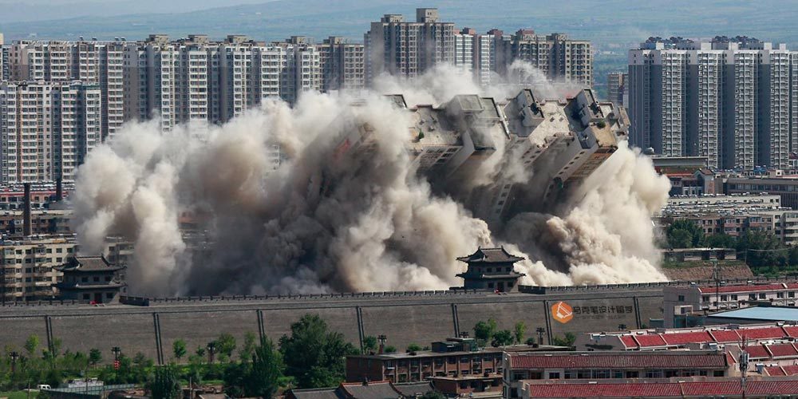

**1\. 项目背景**

大城市的生活开始越来越拥挤，大家压力越来越大，贫富差距也越来越大，于是越来越多的人充满戾气与仇富心态。但另一方面，目前大城市的公共设置越来越完善，公共秩序与管理越来越规范。

同时，目前的“智能化”公共交通管理基本上是“智障”，比如京通高速上的公交拍照，京通老司机心中早已记下了所有的拍照点，可以轻松敏捷的如同一个智障一样躲避拍照。

 

* * *

 

**2\. 项目愿景**

这个项目希望能够成为市政管理的辅助军，以一种简单粗暴的方式威慑交通违法行为，并在法律范围内获得收益。

以一种独特的商业模式聚拢财富，并通过3年购买地球，5年购买整个宇宙

 

* * *

 

**3\. 收入模式**

以自己一定的安全性为代价，让交通违法者付出金钱成本。

模式一 恐吓遮挡号牌狗

我常走的道路有五环、京哈、四环、化工路、京通、长安街，四环内还好，5环、京哈和5环内4环外的非城市干道上，每天都能看到遮挡号牌狗。他们一般都为外地号牌，早高峰期间为了继续上路铤而走险贴住号牌。

根据法律法规，遮挡号牌扣12分+罚款+外地牌照闯限行扣3分+罚款。于是，这样一口气扣15分的老哥就这样出现在你面前，早高峰的拥堵几乎不会有太快的车速，那么轻轻地撞他吧，撞完后停车和气的要他5000块-10000块，价格公道童叟无欺，否则就拿着行车记录走程序，相信15分和5000块的分量都能拿捏得住。

成本：车辆维修500左右/被打的风险

预期收入：7500 元/次

 

模式二 恐吓匝道应急车道狗

别的桥区我不知道，但四惠桥四环向北转京通向西匝道，每天早上无数车辆走应急并且会在拍照之前的位置硬挤进入车流，无耻之极。

根据法律法规，走应急车道扣6分+200元。于是，等它往里挤的时候，轻轻地撞他吧，装完后停车和气的跟他说他全责并要他800块-1000块，价格公道童叟无欺，否则就拿着行车记录走程序，相信6分和1000块的分量都拿捏得住。

成本：车辆补漆300左右（可多次撞击后一次维修，维修厂月卡估计还能优惠）/被打的风险

预期收入：900 元/次

预计毛利润 95-98%，企业所得税25%后净利润70-75%

 

* * *

 

**4\. 财务指标**

 

预期单辆成本：

北京小客车指标租用 1万/年

车辆折旧1万/辆/年

车辆保险:3千/辆/年

油费：3千/辆/年

司机医药费：5000/人/年

故，单辆车年成本：10,000+10,000+3,000+3,000+5,000= 31,000 元

 

预期单辆营收：

模式一日撞击1.5辆，成功率75%

模式一单辆日营收：7500\*1.5\*75%=8,437.5 元

模式二日撞击3辆，成功率85%

模式二单辆日营收：900\*3\*85%=2,295 元

单辆综合日营收：8437.5+2295=10,732.5 元

 

按2017年法定工作日249天计

单辆综合年营收：10732.5\*249=2,672,392.5元

 

故，单辆车年预期收入：2,672,392.5 - 31,000= 2,641,392.5 元

 

税前，且暂未计入北京限行成本

 

* * *

 

**5\. 模式复制可能性**

简单培训即可上岗，培训周期约3天，培训成本：

快餐25元/份 \* 3份/天 \* 3天= 225 元

车辆成本8万/辆

故，每个单辆运营基础成本为 80,255 元

 

* * *

**6\. 公司预期收益：**

成立有限责任公司，无需招募任何员工，人人都是等比例合伙人，预期20人可成为一支车队。

创始公司费用：

20辆车费用：80,000 \* 20 =160,000 元

北京公司注册费用：5,000 元

代理记账费用：500元/月 \* 12月/年 = 6,000 元/年

办公室租赁费用：100,000/年

其他运营费用：30,000/年

首年运营费用：301,000 元

后续运营费用：136,000 元/年

 

**首年净利润 = 车辆收益-首年运营费用：**

**首年净利润：2,641,392.5 \* 20 - 301,000 = 52,526,850 元**

 

**后续年净利润 = 车辆收益-年运营费用：**

**后续年净利润：2,641,392.5 \* 20 - 136,000 = 52,691,850**

 

**若 年收入10%继续投入生产，则次年收入约为：**

**（52,526,850 \* 10% / 8 + 20）\*  2,641,392.5 - 136,000 = 1,734,353,000,000 元**

 

为简单粗暴，以上计算均未计算企业所得税

 

* * *

 

**7\. 公司估值：**

由于独特的商业模式，超低的初始投入与超高的净利率，公司市盈率约100倍（已经非常保守了）

保守估值 = 首年净利润 \* 100倍

**即，首年保守估值为：52,526,850 \* 100 = 5,252,685,000 约525亿元**

同属交通运输行业，参考2018年1月长安汽车公司估值：629.63亿

 

对赌估值 = 预期第二年净利润 \* 市盈率100倍（彼时应该至少1000倍）

**即，次年估值为：((52,526,850 \* 10% / 8 + 20）\* 2,641,392.5 - 136,000)\*100**

**结果为：173,435,300,000,000**

**约：173 万亿**

据世界银行报告，2015年全球GDP总量达74万亿美元，约481万亿人民币

 

**简单说：首年进入交通运输行业TOP10，次年成为世界TOP1，三年买下地球，五年买下宇宙**

为简单粗暴，以上计算均未计算企业所得税

 

* * *

 

**8\. 竞争壁垒**

两年时间火速发展即可买下地球，届时任何壁垒都不复存在

 

* * *

免责声明：此文诞生于某低端创业者对于商业模式与公司运营的思考，以及对于帝都早高峰不守规矩人群的吐槽，切勿当真，一味模仿概不负责。

ps. 本文酝酿于2017年9月，北京最堵月，并稀稀拉拉拖拖延延完稿与2018年1月
