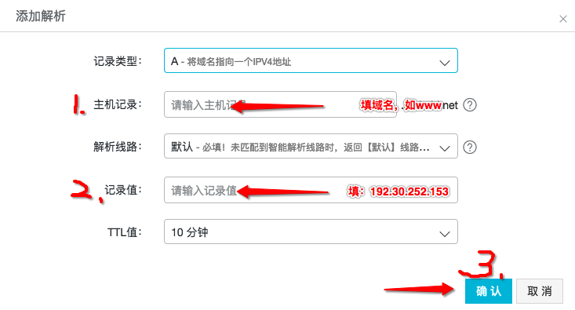
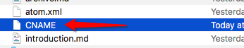

自己建立了一个 Jekyll 的博客做测试，刚才解决了域名绑定，记录一下。

思路来自：http://playingfingers.com/2016/03/26/build-a-blog/#section-2 ，只是他写的比较长，很吓人。于是我写个简单点的：

 

步骤一，配置域名

 

如上图，用A记录解析你希望的二级域名，如输入www，或blog，记录值填写 github 的ip地址 192.30.252.153 即可。或者去[这个网页](https://help.github.com/articles/troubleshooting-custom-domains/#dns-configuration-errors)查看ip.

 

步骤二，添加一个CNAME文件

在网站根目录新建一个 CNAME 文件，无后缀名，打开后填入你配置的域名，保存即可。

注意，只写域名，不要加入 http:// 之类的多余内容。

 

 

以上配置好后，commit + push，最多等几分钟，即可实现绑定+访问。
