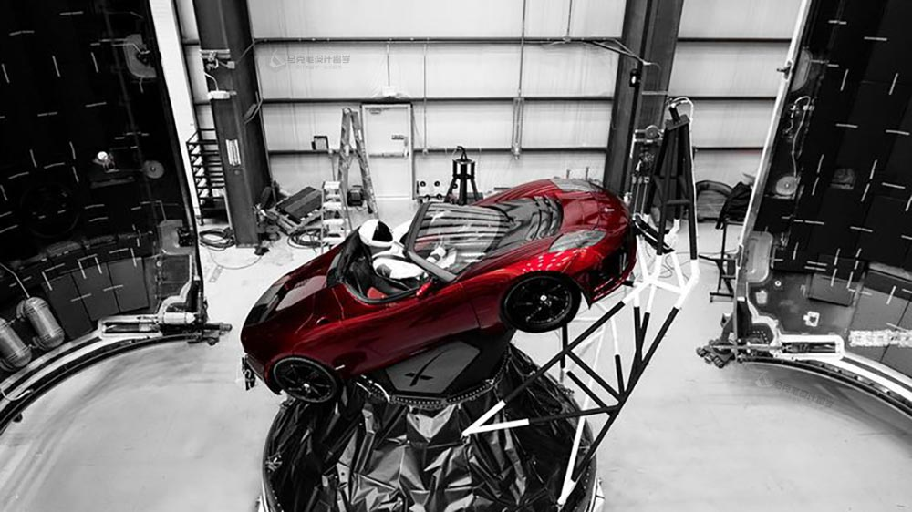
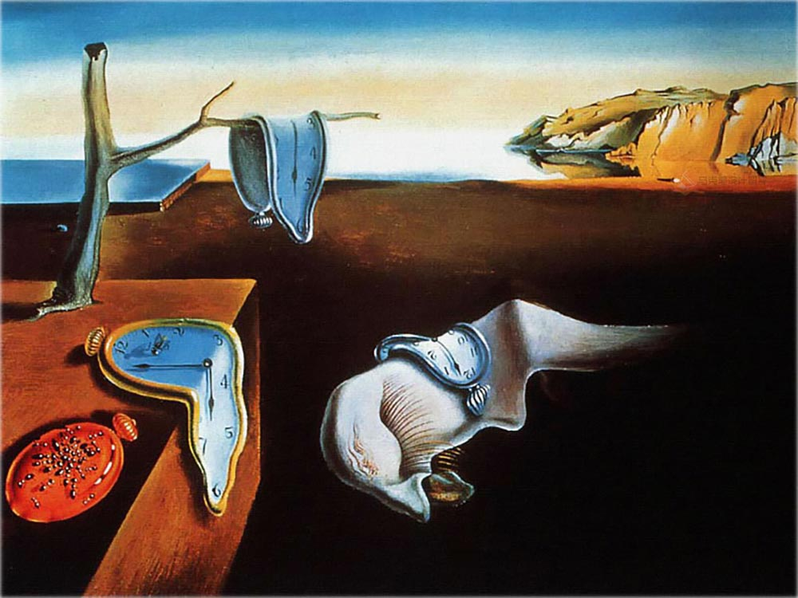

那位长者说过：“一个人的命运啊，当然要靠自我奋斗，但是也要考虑到历史的行程”。对，我们总是处在时代之中：手工艺者赶上工业时代孕育出工业设计师；工业设计师赶上信息时代孕育出交互与体验设计师。时代为我们的经历圈定了一个特定的范围和前提。

如果，一旦这个前提被彻底改变或颠覆了会怎样？本文让我们跟随Elon Musk 的火箭直插云霄，去探讨和构想一个新的愿景。

## · 宏大与渺小 ·

Elon Musk又让这个世界沸腾了一波。 他用自己公司的火箭把自己公司的汽车送上火星轨道，不出意外，假人将驾驶着Tesla 在火星轨道运行10亿年。Amazing！！！！！只是没想到，火箭的助推器完成使命后，竟然被回收了。嗯，这很节俭。这样的“成就”，还需要用收入、估值、上市等标准来衡量，感觉价值观都要被颠覆了。

高晓松说，生活不止眼前的苟且，还有诗和远方的田野。Musk 为人类描绘的浩瀚宇宙，是我们尚未看清但充满期待的未知世界。当我们还在纠结哪个专业更好，哪个学校更好，北京房价太高，中年是否会焦虑的时候，这一支火箭将我们的思绪从身边拉起，直插浩瀚宇宙。

在这样宏伟的愿景之下，我们的日常均变成了苟且，那诗和远方在哪里？

## · 设计源假设的崩塌 ·

Musk 的宏大愿景虽不至于摧毁人类现在的世界观和使命感，但确实给了每一个人仰望星空的理由，让人们反思甚至怀疑自己的追求是否太过渺小。这样的撼动哪怕只有一点点，可能都将强力地扩展人类的思维边界。

任何学科都有一个源头的假设：先预设 1+1 =2， 才有了后续“计算”概念的出现和发展；假设人们都是理性的，经济学才有了后续繁荣而复杂的金融和经济。那设计的源命题呢？对，就是我们每个设计师大学伊始学习的——设计是解决问题的。

如同一只火箭极大拓展我们对于宇宙的愿景，那设计的愿景呢？如果**设计愿景****足够宏大，是不是****能够撼动****甚至****摧毁设计的源命题呢**？试想，若干年后，设计师面对的不再是用户的问题和痛点(problems & painpoints)，而必须带着独特而敏锐的洞察(insight)，去引导用户的行为、体验、期待，乃至思维方式和世界观，那究竟会变成一番怎样的景象。

设计师不再面对用户问题的时候，那将是怎样的茫然和无助，如同深处漩涡之中，身边的世界轰然倒塌。

## · 新的遐想 ·

试想，我们能够如同达利一般看到之前所不能看到的，构想之前所不能构想的，期待之前所不能期待的，那么这样大破大立的世界，设计师不再为“问题”服务，将构造一个什么样的设计愿景？

**遐想，设计师将会转变为一个生活方式的体验者与布道者。**

设计师不再是以一个修补匠的身份修补这个世界，而是如同那一枚火箭穿越了时间，去创造与体验新的生活方式，去寻求新的生活可能，去为人类探索新的方向，并坚定为之奋袖呐喊，以一种具备未来洞察力的姿态引导世界。

回看历史，Steve Jobs 在发布第一代iPhone 时以一种伟岸却谦逊的姿态说道，"Every once in a while a revolutionary product comes along that changes everything", 后来的事情大家都知道了。2007年，Steve Jobs 能够兴奋地穿越时间来体验 “真正智能手机” 给人类带来的便利，再穿越回到彼时激动地向世界宣布：看呐，那就是未来！

未来的设计师，就像洞穴寓言中的疯子，会为别人眼中不存在的世界奋力呼号。诚然，也许大多数看到的仍是一层或另一层的投影，但极少数眼中能够看到真实的世界的设计师，带给我们的，将是怎样的另一个“浩瀚太空” 。

**总结**

交互设计、服务设计、用户体验设计的初衷，无不是突破原有设计的界限，从新的维度建立新的愿景与使命。在可预见的未来，新的设计概念与设计方法将会层出不穷，以量变或者质变的方式，一步步改变直至革命现有设计的体系，大破大立般拥有新的假设，建立新秩序和方法。

困于案几，也须记得遥望星空。

————————————

本文为本人有感于SpaceX的宏大，首发于：http://www.makebi.net/26631.html
